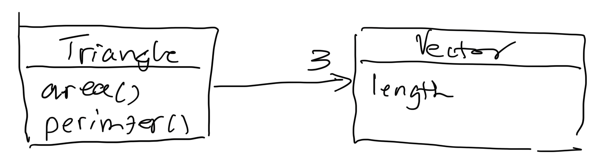

### OOP - Fall, 2025
- Instructor: Prof Y C Cheng
- Office: Room 1531, S&T
- Class meeting: Mon 10:10 ~ 12:00, Tue 14:10 ~ 15:00, @Room 204, CB II
- Office hours: Mon 13:10-16:00, Tue 8:10-11:00, 
- TA: Benny Wang  
- TA hours: Fri 10:00-12:00, Room 1324, S&T
- TA E-mail: benny870704@gmail.com
- [course repo](http://140.124.181.100/yccheng/oop2025f): this page, access with VPN
- [homework repo](http://140.124.181.100/course/oop2025f_assignment): TA's page
- [bulletin board](https://teams.microsoft.com/l/team/19%3AL0LI-oKgDUaCK7tMbPINzifPNCc6-X5z4RohU_zIYKY1%40thread.tacv2/conversations?groupId=015437fa-f55a-4ecf-a770-722c364b48bf&tenantId=dfb5e216-2b8a-4b32-b1cb-e786a1095218): Microsoft Teams as bulletin board

### Grading
- Homework: 10 assignments, 25%
- Online Coding Tests * 3 (25% each)
- failing rate in the past: about 20%-25%

### Introduction

This course teaches you four types of things you will use for the rest of your career:

- problem solving [How To Solve It](http://htsicpp.blogspot.com/2014/08/introducing-how-to-solve-it-cpp.html)
- a programming language, in this case C++ (version 20), including basics, functions, objects, lambdas and templates 
- engineering practices, including version control, make, iterative and incremental development, test driven development, refactoring, pair programming, and mob programming
- tooling: shell, c++ compiler, ide, builder, git
- **AI coding: prompts and contexts** 

We will do this with a few examples
- coding in class involving YOU and YOUR LEARNING PARTNERS

One of the problems we will be solving:

**Problem: sorting shapes**
A simple geometry application called _geo_ is needed to sort shapes such as triangles, circles, rectangles and others. As a command line application, _geo_ reads shapes from an input file, sorts the shapes by area or perimeter in increasing order or decreasing order, and write the result to an output file. For example,
```bash
geo input.txt output.txt area inc
```
sorts the shapes in file _input.txt_ in increasing order by area, and writes the result to the file _output.txt_. And
```bash
geo input.txt output.txt perimeter dec
```
sorts the shapes in file _input.txt_ in decreasing order by perimeter, and writes the result to the file _output.txt_.

### Main references

- [cplusplus.com](https://www.cplusplus.com/)
- [cppreference.com](https://en.cppreference.com/w/)
- [googletest](https://github.com/google/googletest/blob/master/docs/primer.md)
- [How To Solve It: CPP](http://htsicpp.blogspot.com/2014/08/introducing-how-to-solve-it-cpp.html)

#### Week 1
Getting started with object-oriented programming in C++

- OS: Ubuntu on Windows/Linux/MacOS
  - commands: cd, pwd, ls, mkdir/rmdir, rm, etc. [Linux command line for beginners](hhttps://ubuntu.com/tutorials/command-line-for-beginners#1-overview)
- editor: Visual Studio Code
- compiler: c++11
- builder: make with makefile
- unit testing: googletest
- language: C++
  - program entry point: main
  - std::cout in `<iostream>`
  - std::string in `<string>`

**Problem 0**   
Write a program that generates the line “Hello, \<name>, I hope you’re having a wonderful day!” Where \<name> is a command line argument. The executable is “hello”. For example, the command line
“hello Joe”
Prints 

“Hello, Joe, I hope you’re having a wonderful day!”

**The ChatGPT prompt used in class**  
- how do i use argc and argv in c program?

##### 0909 Class Prompt

- `幫我根據inner_product裡的資料夾結構寫出相對應的CMake file，我要使用c++20以及googletest v1.17.0(用FetchContent安裝)，再產生一個dummy test`

- `Build me the dummy test`

- `Write me a .gitignore file`

- `Commit my work today`

#### Week 2    
- the **skill tree**, again

**Problem 1**. Practicing **TDD**, write a **function** to compute the **inner product** (or **dot product**) of two **vectors** when it is defined. For example,

      [1, 0] · [1, 1] = 1,
      [1, 1, 0] · [0, 1, 1] = 1, and
      [1, 0] · [1, 1, 0] => undefined.

- Our plan for the problem of computing inner product
  For more detail, see [Inner product, round 1](http://htsicpp.blogspot.tw/2014/08/inner-product-round-1.html)

**Week2 summary** 

- *overloading* of “+”: the symbol “+” has *multiple meanings*
- *program literacy*: the ability to *read and understand computer programs* 

Function 
- abstraction of computation
- name + prototype:
    - what you want to call it?
    - what are its arguments (name + type)?
    - What is its return value (name + type)?

##### 0915 Class Prompt
- `I have edited some file in src, and call it from test, please refine the CMakeLists.txt for me.`

##### 0916 Class Prompt
- `How do I use NaN? What is its type?`
- `Can I compare NaN?`

#### Week 3 
- Objects raise the level of abstraction
- A triangle has three vertices, each of which is a vector

  - *volley* between Triangle and Vector: In calculating the perimeter and area, we discovered that "-" operator is needed to subtract two vectors 
    - suspend coding for member functions primeter and area
    - TDD for "-" operator on Vector
    - return to TDD for perimeter
    - TDD for area
- class diagram:
  - class name, member function, and data members (usually omitted to avoid cluttering)
  - an *object* is an *instance of a class* 
  - relationship between classes
    - a triangle is *determined by three 2D-vectors*
    - a triangle *depends on* three vectors 
- compare Vector with the "vector" in inner product: "vector" is represented by an array of doubles (*primitives*)

##### 0922 Class Prompt
- `我有一個不完整的cmakelist file，請參考目錄結構幫我補齊cmakefile`
- `幫我在tests中新增dummy_test.cpp`
- `幫我編譯執行`

##### 0923 References
- https://cplusplus.com/doc/tutorial/classes/
- https://en.cppreference.com/w/cpp/language/classes.html

#### Week 4 
Objects
  - A triangle has three vertices that are points
    - dependency
  - computing area and perimeter: needs distance between two points
    - as a C-style function
      - parameter passing **TODO**
        - call by value (default)
        - call by reference (more efficient)
    - as a member function
  - Point and Triangle are **user-defined types**
    - how do we construct an instance of a Point or a Triangle?
      - constructors **TODO**
        - used by programmer
        - used by C++ runtime: copy constructor

#### Week 5
- Circle
- Circle and Triangle as Shape
  - Circle and Triangle are **concrete classes**: they **can create instances**
    - by **constructor** or **initializer**
  - Shape is an **abstract class**: it **cannot create an instance**
- sorting shapes by increasing area
  - std::sort a sorting function in the C++ standard library
  - examples: sorting integers

#### Week 6 

**Lab test 1: 10/13, Monday 10:10 am - 12:10 pm @Room 1223, S&T**

- use list initialization when declaring objects
- write constructors to support it

#### Week 7

Polymorphism through subtyping (Subtype polymorphism)

To have a polymorphic area() function:
1. Declare a Shape base class with area() as a virtual function
2. Derive Circle and Triangle classes from Shape; override area()
3. Use a **pointer** or **reference** to a shape object to call area()

Other types of polymorphisms:
- ad hoc polymorphism: by overloading 
  - available in C, a **statically-typed** language
- parametric polymorphism: a template function can take an argument that has an area() function
  - available in **statically typed languages supporting generic programming** like C++, Java, and Go
- duck typing: so long as an object has the area function, its area can be calculated
  - available in **dynamic typed languages** like Python, JavaScript, Ruby, etc.

Sorting shapes 
- What Shape type to put in std::vector?
  - Elements in the vector must enable polymorphism and movements (due to sorting)
- std::sort: 
  - begin element, end element, 
  - comparator 
    - lambda
    - pointer to function
    - functor **todo**

#### Week 8

Writing to files:
  - What is a file? 
    - What's the abstraction in C++? stream
  - Where is it?  
    - ```std::filesystem::path output_path = "./tmp/test_output.txt"```;
  - How to write?
    - stream insertion operator ```<<```
  - How to test?==> Find an equivalent but easily manipulated abstraction for testing
    - [```ostringstream```](https://cplusplus.com/reference/iolibrary/)
  - How to set format, e.g., fixed, four position after decimal point
    - use the iomanip functions ```std::fixed```, ```std::setprecision```
 before inserting into stream

Reading from file:
  - each line a shape: get the whole line
    - std::getline(file, line) 

memory leak
C++
    std::vector<std::unique_ptr<Shape>> shapes;
    shapes.push_back(std::make_unique<Triangle>(p1, p2, p3));
    shapes.push_back(std::make_unique<Triangle>(q1, q2, q3));

C++ file system API
  std::filesystem::path input_path;
  std::ofstream ofs(input_path.string());
  std::filesystem::remove(input_path);

Parameter passing

#### Week 9

Rule of Three: If a class needs a user-defined destructor, a user-defined copy constructor, or a user-defined copy assignment operator, it almost certainly needs all three.

RAII: Resource Acquisition Is Initialization.

It's a programming idiom where you tie the lifetime of a resource (like memory, a file handle, a network socket, or a database connection) to the lifetime of an object.

The core principle is:

Acquisition: The resource is acquired in the object's constructor.
Release: The resource is released in the object's destructor.

The ConvexPolygon class implements RAII.
  
#### Week 10
- ConvexPolygon
  - using Point over Point * to avoid implementing the Rule of Three
  - area and perimeter
  - strength of a test case: assuming tests are written correctly,
    - Passing tests does not prove correctness (the absence of bugs) of the test program;
    - A failed test proves incorrectness (the existence of bugs) of the tested program
    - Find strong test data (fixture) to avoid bugs slipping through them
      - the test with Point(0,0) failed to capture the index out-of-bound bug
      - the hourglass (P0, P2, P3, P1) that has the same area as the intended rectangle (P0, P1, P2, P3)

- how C++ compiler handles template
  - parametric polymorphism through ad hoc polymorphism (overloading): template instantiation
- Applicable comparators in std::sort
  - pointer to function
  - lambda
  - functor (function object)
    - overloading the function call operator 'operator ()'
- Reuse through abstraction: algorithms-iterators-containers

#### Week 11

template function
  - example my_swap as a template function: type must support copy assignment

- how C++ compiler handles template
  - parametric polymorphism through ad hoc polymorphism (overloading): template instantiation

C++ exception handling is a critical mechanism in C++ for dealing with runtime errors or exceptional conditions that disrupt the normal flow of a program. It provides a clean, structured way to separate error-detection code from error-handling code.

The C++ exception handling model is built around three main keywords: try, throw, and catch.
- try block: The try block encloses the code segment that might generate an exception. If an exception occurs within the try block, execution immediately jumps to the corresponding catch block.

- throw expression: The throw expression is used to signal that an exceptional event has occurred. The operand of throw (the "exception object") is what gets transferred to the handler. You can throw objects of any type (including built-in types like int, or custom classes), but std::exception is the preferred type.

- catch block (The Handler): The catch block is the exception handler. It immediately follows a try block. It specifies the type of exception it can handle. If the type of the thrown exception matches the type in the catch parameter, the code inside the catch block executes.
  - throw by value; catch by reference (for polymorphism)

- [std::exception in <exception>](https://cplusplus.com/reference/exception/exception/exception/)

- noexcept specifying a function does no throw exception with 
  - a noexcept function throwing an exception cause the program to terminate with std::terminate()
  
#### Week 12 (11/24 10:10-12:10)
**Lab test 2** 

#### Week 13
Memory management:
Assume a CompoundShape owns its components.

std::unique_ptr
std::make_unique
 
- ```std::remove```, ```std::remove_if```, ```vector<T>::erase```
- ```std::make_unique``` ```std::move```
- add: transfer ownership ```void add(std::unique_ptr<Shape>)```
- remove: identify shapes to be removed ```void remove(const Shape* s)```
- raw pointers are client-facing

#### Week 14
Caveats of CompoundShapeUnique

returning a raw_pointer risks dangling reference: crashes
* access ptr after composite go out of scope
* delete ptr and then composite go out of scope

solution: don’t return raw pointer, return a handle (ticket), use it to get a reference to the shape object
- write the test: add c, add t, remove c, get t, move construct it, move copy it, go out of the way to crash it  
- (X) why vector<std::unique_ptr<Shape>> does not work
    - c = add, t = add, remove c
    - t invalid
- use an unordered_map, not vector
    - find(handle): IT
    - key: it->first; value: it->second
    - operator [handle]
    - erase(IT)
- add returing a “handle” (check a hat and get a claim ticket)
- handle don’t get reused: OK to have “holes in keys” of the unordered map 
- get(handle) returns reference to object pointed to by the raw pointer throws and exception if no unique_ptr exists for the handle
    *  when a reference variable goes out of scope, almost nothing happens.
- move constructor and move copy assignment (rule of zero)

- Simple factory
  - ensure a shape created is legitimate: circle with negative radius
  - update add to check nullptr and return illegal handle

#### Week 15

find sum of areas of triangles in a compound
  - to_string 
  - Runtime type information (RTTI)
    - typeid
    - dynamic_cast
template member function:


Programming to an interface

#### Week 16, 18
Lectures

#### Week 17 (12/29 10:10-12:10)
**Lab test 3**


